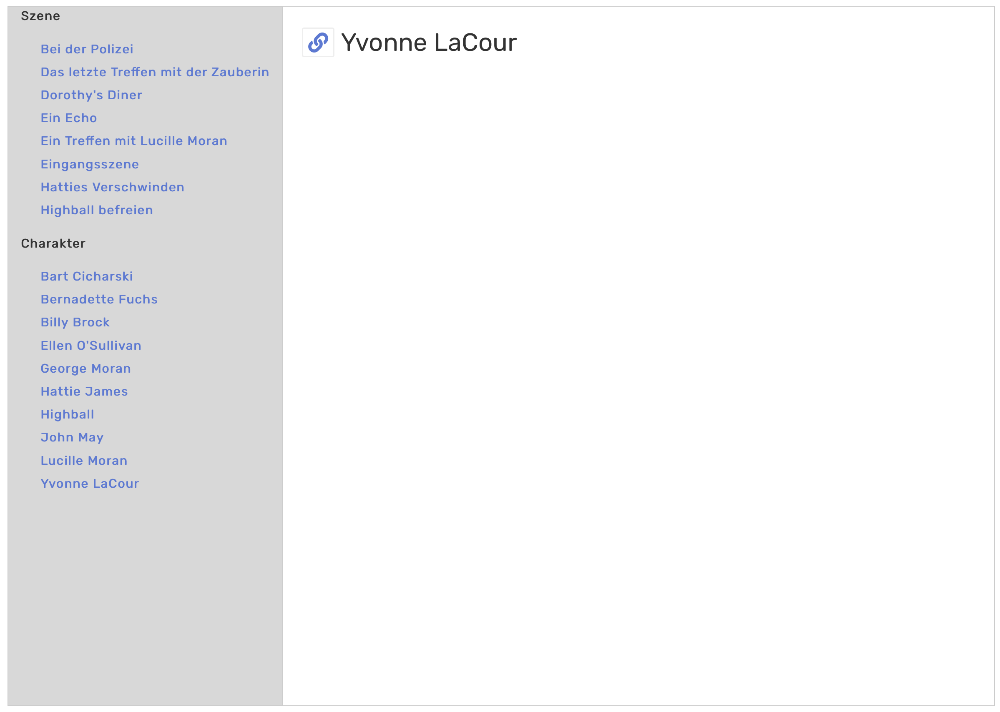

# TiddlyWiki Snippets

Just a bunch of some snippets I like and wanted to share

## Categorized TOC

Assume you have a few pages, that are all tagged with one specific tag, but also another, which adds subcategories. These categories are orthogonal to the first tag.

E.g. in a Pen and Paper roleplay you usually have an adventure, and in the adventure you have characters and scenes. Character and scenes are generic and not part of the specific adventure. But you probably want to have it grouped by this tag.

Usage:
```
<$macrocall
	$name="toc-tabbed-internal-nav-mb"
	tag="The Adventure"
  groups="scene character"
	selectedTiddler="$:/temp/toc/selectedTiddler"
	unselectedText="<p>select something.</p>"
	missingText="<p>Missing tiddler.</p>"
/>

```

[HERE]($__custom_macros_AdventureOverviewToc.tid)


